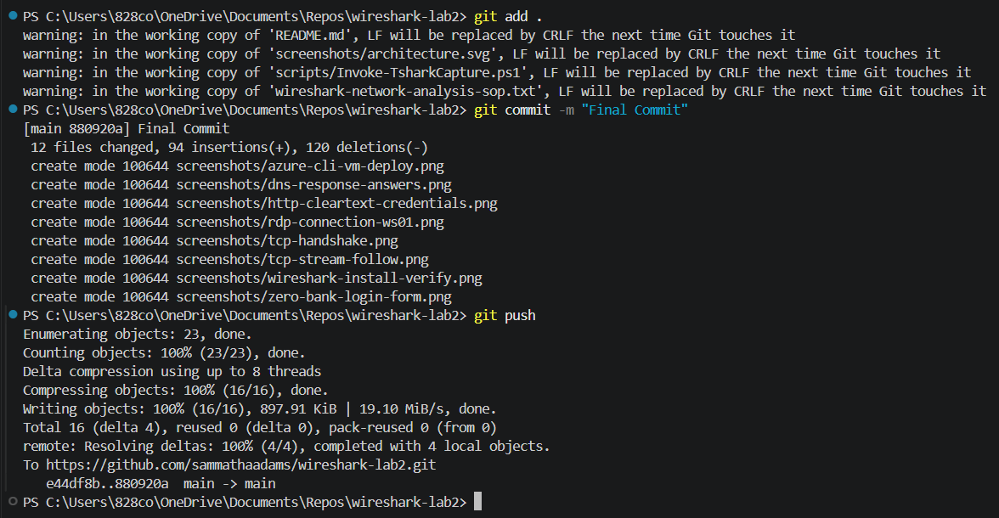

# Wireshark Network Analysis Lab 2 — Packet Capture & Protocol Inspection

## Overview

This lab demonstrates hands-on network traffic analysis using Wireshark, the industry-standard open-source packet capture tool. It covers live traffic capture, display filter construction, DNS query/response inspection, TCP three-way handshake observation, cleartext credential exposure over HTTP, and full TCP stream reconstruction — reflecting real-world workflows used by SOC analysts, network engineers, and incident responders.

**Tool:** Wireshark (free, open source — no account or licence required)  
**Platform:** Microsoft Azure — Windows Server 2025 VM provisioned via Azure CLI  
**Automation:** PowerShell (`Start-HttpTestServer.ps1`, `Invoke-TsharkCapture.ps1`)  
**Certification Alignment:** CompTIA Network+ · Security+ · CySA+

---

## Business Context

Every network event — a failed login, a slow service, a suspicious connection — leaves a trace in the underlying packet stream. Organizations use packet capture as the definitive diagnostic tool when logs are ambiguous or incomplete. Wireshark allows engineers to inspect traffic at every layer of the protocol stack, from the Ethernet frame to the application payload.

This lab simulates four scenarios that appear regularly in enterprise environments: resolving DNS failures by tracing query/response pairs; diagnosing broken connections by spotting incomplete TCP handshakes; identifying insecure applications that expose credentials in cleartext HTTP; and reconstructing the complete conversation between two hosts during an incident investigation.

The analytical skills built here transfer directly to cloud-native tooling — Azure Network Watcher, VPC Flow Logs, and Microsoft Sentinel all surface the same protocol-layer patterns that Wireshark makes visible at the packet level.

---

## Prerequisites

- Azure subscription with permissions to create Resource Groups, VMs, VNets, and NSGs
- Azure CLI installed locally (`az --version` to verify)
- Windows Remote Desktop client
- PowerShell 5.1+ (available on Windows Server 2025 by default)
- Basic familiarity with IP networking concepts (IP addresses, ports, protocols)

---

## Architecture

| Resource | Name | Type |
|---|---|---|
| Resource Group | `rg-lab02-0626` | Azure Resource Group |
| Virtual Machine | `ws01` | `Microsoft.Compute/virtualMachine` |
| Virtual Network | `ws01-vnet` | Azure VNet |
| Network Security Group | `ws01-nsg` | Azure NSG |

---

## Steps

### 1. Initialize the Project Repository

Create the local project directory, initialize Git, and scaffold the folder structure.

```powershell
mkdir wireshark-lab2
cd wireshark-lab2
git init
echo "# Wireshark Network Analysis Lab" > README.md
mkdir scripts screenshots
```


---

### 2. Deploy the Azure Virtual Machine

Provision a Windows Server 2025 VM to Azure using the Azure CLI. The deployment creates the VM, a VNet, and an NSG in a single operation under resource group `rg-lab02-0626`.

- **VM Name:** `ws01`
- **Subscription:** Azure subscription 1
- **Resource Group:** `rg-lab02-0626`
- **Image:** Windows Server 2025 Datacenter
- **Size:** Standard_B2s

```bash
# Create the resource group
az group create --name rg-lab02-0626 --location eastus

# Deploy the Windows Server 2025 VM
az vm create \
  --resource-group rg-lab02-0626 \
  --name ws01 \
  --image Win2025Datacenter \
  --admin-username azureuser \
  --admin-password 'YourStrongPassword123!' \
  --public-ip-sku Standard \
  --size Standard_B2s

# Open RDP port 3389
az vm open-port --resource-group rg-lab02-0626 --name ws01 --port 3389

# Retrieve the public IP address
az vm list-ip-addresses \
  --resource-group rg-lab02-0626 \
  --name ws01 \
  --query "[0].virtualMachine.network.publicIpAddresses[0].ipAddress" \
  -o tsv
```


---

### 3. Connect via Remote Desktop (RDP)

Once the VM is running, retrieve its public IP from the Azure CLI output above and connect using Remote Desktop.

- Authenticate with the `azureuser` credentials set during VM creation.

```bash
# Confirm VM is running before connecting
az vm show --resource-group rg-lab02-0626 --name ws01 --query "powerState" -d -o tsv
```


---

### 4. Install Wireshark on the VM

From inside the RDP session, open **PowerShell as Administrator** on `ws01` and run the following to download and silently install Wireshark with Npcap:

```powershell
# Download Wireshark installer
$url  = "https://2.na.dl.wireshark.org/win64/Wireshark-latest-x64.exe"
$dest = "$env:TEMP\wireshark-installer.exe"
Invoke-WebRequest -Uri $url -OutFile $dest

# Silent install — accepts defaults and installs Npcap automatically
Start-Process -FilePath $dest -ArgumentList "/S" -Wait

# Verify installation
& "C:\Program Files\Wireshark\tshark.exe" --version
```

Both Wireshark and Npcap install silently. Npcap is the Windows packet capture driver — without it, Wireshark cannot read raw network traffic.


---

### 5. Your First Capture — Orient Yourself

Open Wireshark. The welcome screen shows all available network interfaces with live wave graphs indicating current traffic volume.

1. Double-click your active interface (the one with the most wave graph activity — usually **Ethernet** or **Wi-Fi**)
2. Wireshark begins capturing — packets appear in the list in real time
3. Open a browser and navigate to any website
4. After 30 seconds, click the **red square Stop** button in the toolbar

You now have a packet capture in memory. The volume (hundreds or thousands of packets from 30 seconds of browsing) is why display filters are essential.


---

### 6. Apply Display Filters

Type a filter into the filter bar at the top of the Wireshark window and press **Enter**. The packet list updates instantly.

| Filter | What It Shows |
|---|---|
| `dns` | All DNS queries and responses |
| `http` | Unencrypted HTTP traffic only |
| `tcp` | All TCP traffic |
| `tcp.flags.syn == 1` | TCP SYN packets — connection attempts |
| `tcp.flags.reset == 1` | TCP RST packets — refused/closed connections |
| `icmp` | All ICMP including ping |
| `ip.addr == 192.168.1.1` | All traffic to or from a specific IP |
| `http.request.method == POST` | HTTP POST requests (login form submissions) |

> **Display vs Capture filters:** Display filters are applied after capture — they hide packets without discarding them. Always use display filters in this lab so you can re-examine the same capture through multiple lenses.


---

### 7. Exercise A — Capture a DNS Lookup

Start a capture, run `nslookup google.com` from a separate terminal window, stop the capture, and apply the `dns` filter.

```cmd
nslookup google.com
```

In the packet list, find:
- **Query:** Info column shows `Standard query A google.com`
- **Response:** Info column shows `Standard query response A google.com`

Click the response packet → expand **Domain Name System (response)** → expand **Answers** → confirm the A record IP matches the nslookup terminal output.


> **Why this matters in production:** Unexpected DNS queries to unknown domains are one of the earliest indicators of malware phoning home to a command-and-control server. SOC analysts apply the `dns` filter as a first step in any suspicious-host investigation.

---

### 8. Exercise B — Watch the TCP Three-Way Handshake

Start a capture, navigate to `http://example.com`, stop the capture, get the IP with `nslookup example.com`, then apply:

```
tcp and ip.addr == 93.184.216.34
```

Find the three-packet handshake:

| Packet | Flags | Meaning |
|---|---|---|
| 1st | `SYN` | Your machine: "I want to connect. Here is my sequence number." |
| 2nd | `SYN, ACK` | Server: "I got your request. Here is my sequence number. Accepted." |
| 3rd | `ACK` | Your machine: "Got it. Connection is open. Ready to send data." |

> **Diagnostic patterns:** SYN with no SYN-ACK = server unreachable or port blocked. RST packet = connection forcibly terminated. These two patterns are the primary signals when diagnosing connectivity failures.


---

### 9. Exercise C — Spot Cleartext Credentials (HTTP)

> **Educational use only.** Only capture on networks and systems you own or have explicit permission to test.

Start the local HTTP test server:

```powershell
.\scripts\Start-HttpTestServer.ps1
```

The script launches a login form at `http://localhost:8080`. In Wireshark, capture on the **loopback interface**. Submit the form with test credentials, stop the capture, and apply:

```
http.request.method == POST
```

Click the POST packet → expand **Hypertext Transfer Protocol** → expand **HTML Form URL Encoded** → username and password are visible in plaintext.


> **Why this matters:** Without TLS encryption, anyone on the network path — an ISP, a coffee shop router, a man-in-the-middle attacker — can read credentials exactly as typed. This demonstration is how security teams prove the vulnerability to developers who resist adopting HTTPS.

---

### 10. Exercise D — Follow a Full TCP Stream

Capture any HTTP traffic, right-click an HTTP packet, and select **Follow → TCP Stream**.

Wireshark reassembles the complete conversation:
- **Red text** — your browser's outbound HTTP request (headers, method, path)
- **Blue text** — the server's inbound response (status code, headers, HTML body)


> **Incident response application:** Individual packets are fragments — the stream view shows the complete conversation. Incident responders use this to reconstruct exactly what data was transferred and what commands were issued during a network event.

---

### 11. Save and Export Captures

```
# Save full capture
File → Save As → dns-lookup-google.pcapng

# Export only filtered packets
Apply display filter → File → Export Specified Packets → Displayed

# Automate capture via tshark (terminal)
.\scripts\Invoke-TsharkCapture.ps1 -Interface "Wi-Fi" -OutputFile "capture.pcapng" -DurationSec 30
```


---

### 12. Commit and Push to GitHub

```bash
git add .
git commit -m "feat: wireshark lab2 — dns, tcp handshake, cleartext creds, stream analysis"
git push
```



---

## Key Skills Demonstrated

- Azure CLI VM provisioning — resource group, VM, VNet, NSG, and RDP port configuration
- Windows Server 2025 VM deployment and Remote Desktop access
- Wireshark silent installation via PowerShell on a cloud-hosted VM
- Live packet capture on active network interfaces
- Display filter construction for DNS, TCP, HTTP, and IP-specific traffic isolation
- DNS query and response packet analysis including A record inspection
- TCP three-way handshake identification and connectivity diagnosis
- Cleartext credential exposure demonstration via HTTP POST capture
- TCP stream reconstruction for full client/server conversation review
- tshark CLI automation for scriptable and headless packet capture
- `.pcapng` file management and Git version control for network analysis artefacts

---

## Cleanup

To avoid ongoing Azure charges, deallocate or delete the `ws01` VM and all associated resources from the `rg-lab02-0626` resource group when the lab is complete.

```bash
az group delete --name rg-lab02-0626 --yes --no-wait
```
